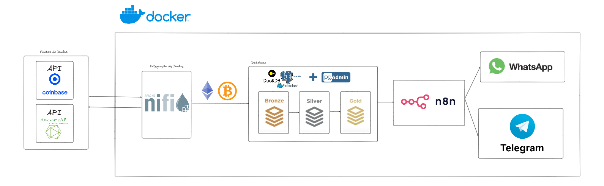
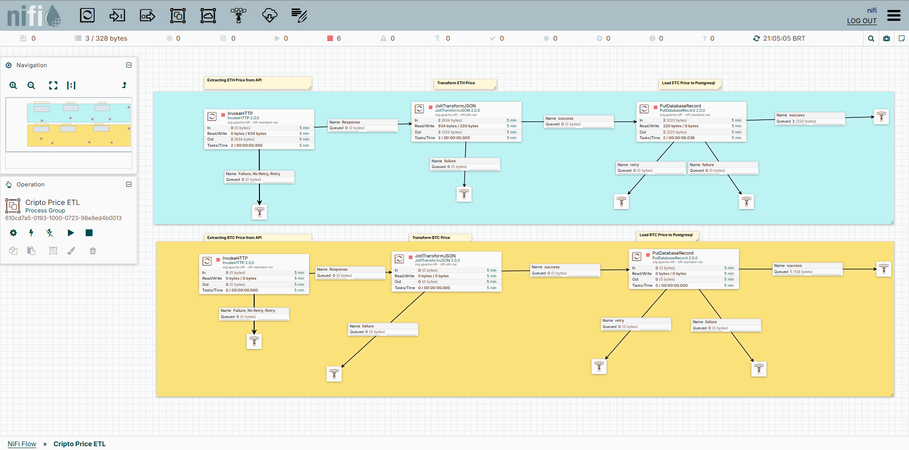
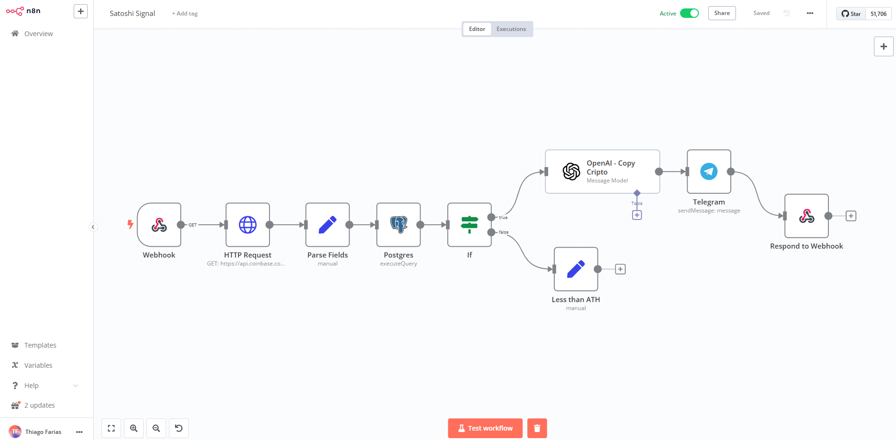

# **Projeto de Alertas Cripto com Análise de Preços em Tempo Real**

---

## 📌 **Descrição do Projeto**
Este projeto tem como objetivo enviar **alertas automatizados** para **WhatsApp** e **Telegram** com preços em tempo real do **Bitcoin (BTC)** e **Ethereum (ETH)**, incluindo análises geradas por Inteligência Artificial (IA). O sistema identifica se o preço atual supera o valor máximo da semana, gerando insights valiosos e acionáveis para traders e entusiastas de criptomoedas.

<p align="center">

</p>

---

## 🔧 **Tecnologias Utilizadas**
- **Apache NiFi**: Coleta os preços do BTC e ETH em USD e BRL.
- **n8n**: Criação de workflows automatizados para monitoramento e envio de alertas.
- **PostgreSQL + pg_duckdb**: Banco de dados relacional para armazenar os dados históricos e realizar consultas analíticas.
   - **pg_duckdb** permite otimização para consultas analíticas em armazenamento colunar.
- **OpenAI**: Geração de mensagens (copy) analíticas personalizadas com base nos dados processados.
- **Docker Compose**: Facilita a orquestração dos serviços.

---

## ⚙️ **Como Funciona**
1. **Coleta de Dados**:  
   O **NiFi** busca os preços do BTC e ETH em tempo real da **API Coinbase** e salva no banco de dados PostgreSQL:
   ```plaintext
   https://api.coinbase.com/v2/prices/spot?currency=USD
   ```

<p align="center">

</p>

2. **Monitoramento e Análise**:
   - O **n8n** cria um workflow que:
     - Consulta os preços atuais obtidos via API.
     - Executa uma query SQL no PostgreSQL para verificar se o preço atual supera o **preço máximo da semana** armazenado no banco de dados.

<p align="center">

</p>

3. **Geração de Alertas**:
   - Caso o preço atual ultrapasse o máximo semanal:
     - A **OpenAI** gera um texto analítico (copy) com as informações:
       - Preço atual (USD e BRL).
       - Análise contextual do movimento de preço.
   - O texto é então enviado automaticamente para **WhatsApp** e/ou **Telegram**.

---

## 🐳 **Execução com Docker Compose**
1. Clone o repositório:
   ```bash
   git clone https://github.com/seu-usuario/nome-do-projeto.git
   cd satoshi-signal
   ```

2. Suba os serviços com o Docker Compose:
   ```bash
   docker-compose up -d --build
   ```

3. Acesse o **n8n** e **NiFi** nas portas configuradas para configurar os fluxos.

---

## 🛠️ **Configurações**
- **API Coinbase**: Certifique-se de ter acesso à API de preços.  
- **Credenciais OpenAI**: Configure a chave de API para a geração de mensagens.
- **Telegram/WhatsApp**: Configure os bots e tokens necessários para envio de mensagens.

---

## 📈 **Benefícios**
- ⚡ **Tempo Real**: Alertas instantâneos assim que o preço ultrapassa máximas semanais.
- 🤖 **Análises Automatizadas**: Insights gerados com IA baseados nos dados coletados.
- 📊 **Escalabilidade**: Uso de PostgreSQL com pg_duckdb para consultas analíticas otimizadas.
- 🐳 **Orquestração Simples**: Contêineres Docker facilitam o setup e a execução.

---

## 📬 **Exemplo de Mensagem Enviada**
```plaintext
🚨 Alerta Cripto! 🚨
O preço do BTC acaba de superar a máxima semanal! 📈

- Preço atual: $106,250.00 (USD) | R$ 510,000.00 (BRL)
- Máxima da Semana: $106,130.74 (USD)

🔍 Análise: O Bitcoin rompeu resistências importantes, indicando alta demanda no mercado.

📲 Fique de olho nas próximas movimentações!
```

---

Contribuições são bem-vindas! Abra um **Pull Request** ou reporte problemas na aba **Issues**. 🚀# satoshi-signal
